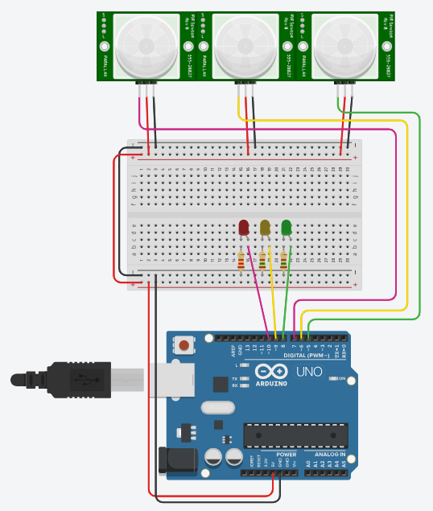

# Interrupt-Driven Traffic Light System

## Overview
An Arduino-based traffic light controller using:
- Pin Change Interrupts (PCI) for PIR sensor inputs
- Timer1 interrupts for light sequencing
- Hardware-efficient design with empty main loop

## Features
- Real-time response to vehicle detection
- Automatic light cycling with 4-phase sequence
- Serial monitoring for debugging
- Atomic operation protection

## Hardware Requirements
- Arduino Uno
- 3x PIR sensors (pins 5-7)
- 3x LEDs (Red/Yellow/Green on pins 8-10)
- 3x 220Ω resistors
- Breadboard and jumper wires

## Installation
1. Clone this repository
2. Open `TaskM1.ino` in Arduino IDE
3. Upload to board

## Usage
1. Sensors on pins 5-7 detect human beings and vehicles
2. System automatically cycles lights every second
3. Sensor triggers synchronize the cycle
4. Monitor via Serial (9600 baud)

## Circuit Diagram
See [docs/circuit_diagram.pdf](./docs/circuit_diagram.pdf) for wiring details.

## Troubleshooting
- Ensure all grounds are connected
- Verify sensor output voltages
- Check Serial Monitor for debug output
